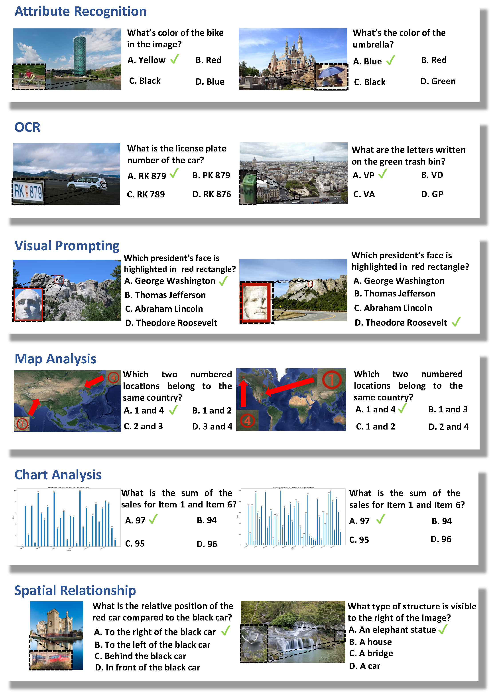
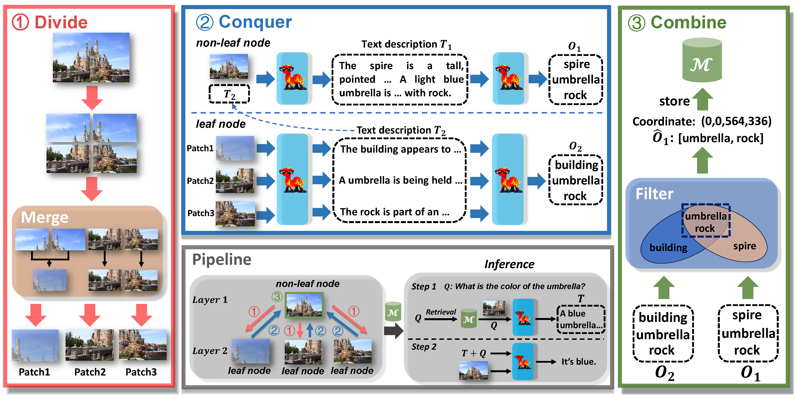

#  Divide, Conquer and Combine: A Training-Free Framework for High-Resolution Image Perception in Multimodal Large Language Models

[**🤗 Dataset**](https://huggingface.co/datasets/DreamMr/HR-Bench) | [**📖 Paper**]
<!-- [**🤗 Dataset**](https://huggingface.co/datasets/DreamMr/HR-Bench) | [**📖 Paper**]() -->

This repo contains the official code and dataset for the paper "[Divide, Conquer and Combine: A Training-Free Framework for High-Resolution Image Perception in Multimodal Large Language Models]()"

## 💡 Highlights
- 🔥 We introduce **_HR-Bench_** to systematically evaluate the perception ability of MLLMs in high-resolution (8K resolution) images.
- 🔥 We propose a training-free framework **$DC^2$** to effectively enhance the MLLM's perceive ability on high-resolution images.

## 📜 News

**[2024.8.23]** 🚀 [Huggingface Dataset](https://huggingface.co/datasets/DreamMr/HR-Bench) and $DC^2$ code are available!

<!-- **[2024.8.26]** 🚀 We released the [ArXiv paper](). -->

## 👀 Introduction

### **HR-Bench**

We find that the highest resolution in existing multimodal benchmarks is only 2K. To address the current lack of high-resolution multimodal benchmarks, we construct **_HR-Bench_**. **_HR-Bench_** consists two sub-tasks: **_Fine-grained Single-instance Perception (FSP)_** and **_Fine-grained Cross-instance Perception (FCP)_**. The **_FSP_** task includes 100 samples, which includes tasks such as attribute recognition, OCR, visual prompting. The **_FCP_** task also comprises 100 samples which encompasses map analysis, chart analysis and spatial relationship assessment. We visualize examples of our **_HR-Bench_**.👇

**_HR-Bench_** is available in two versions: **_HR-Bench 8K_** and **_HR-Bench 4K_**. The **_HR-Bench 8K_** includes images with an average resolution of 8K. Additionally, we manually annotate the coordinates of objects relevant to the questions within the 8K image and crop these image to 4K resolution.

###   Divide, Conquer and Combine

We observe that most current MLLMs (e.g., LLaVA-v1.5) perceive images in a fixed resolution (e.g., $336\times336$). This simplification often leads to greater visual information loss. Based on this finding, we propose a novel training-free framework —— **D**ivide, **C**onquer and **C**ombine (**$DC^2$**). We  first recursively split an image into image patches until they reach the resolution defined by the pretrained vision encoder (e.g., $336\times 336$), merging similar patches for efficiency (**Divide**). Next, we utilize MLLM to generate text description for each image patch and extract objects mentioned in the text descriptions (**Conquer**). Finally, we filter out hallucinated objects resulting from image division and store the coordinates of the image patches which objects appear (**Combine**). During the inference stage, we retrieve the related image patches according to the user prompt to provide accurate text descriptions.

## 🏆 Mini-Leaderboard

We show a mini-leaderboard here and please find more information in our paper.

| Model | **_HR-Bench 4K_** (**_Acc._**) | **_HR-Bench 8K_** (**_Acc._**) | **_Avg._** |
|-------|:--------:|:--------:|:-------:|
|InternVL-2-llama3-76B 🥇 | **71.0** | **61.4** | **66.2** |
|Gemini 1.5 Flash 🥈 | 66.8 | 62.8 | 64.8 |
|InternVL-1.5-26B 🥉 | 60.6 | 57.9 | 59.3 |
| &nbsp;&nbsp;&nbsp;&nbsp; w/ $DC^2$ | 63.4 | 61.3 | 62.3 |
|GPT4o | 59.0 | 55.5 | 57.3 |
|QWen-VL-max | 58.5 | 52.5 | 55.5 |
|Xcomposer2-4kHD-7B | 57.8 | 51.3 | 54.6 |
|LLaVA-HR-X-13B | 53.6 | 46.9 | 50.3 |
|LLaVA-1.6-34B | 52.9 | 47.4 | 50.2 |
|QWen-VL-plus | 53.0 | 46.5 | 49.8 |
|LLaVA-HR-X-7B | 52.0 | 41.6 | 46.8 |

## 📧 Contact
- Wenbin Wang: wangwenbin97@whu.edu.cn 

<!-- ## ✒️ Citation -->

## Acknowledgement
- This work is built upon the [VLMEvalKit](https://github.com/open-compass/VLMEvalKit)
